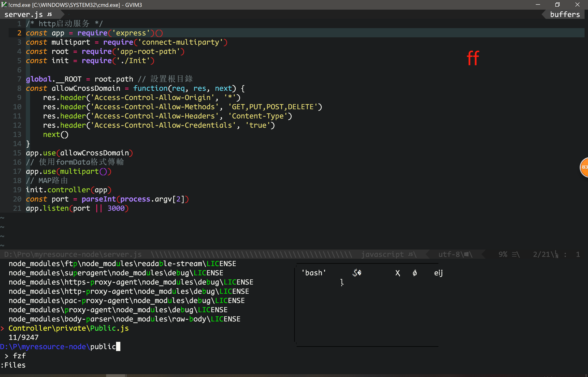
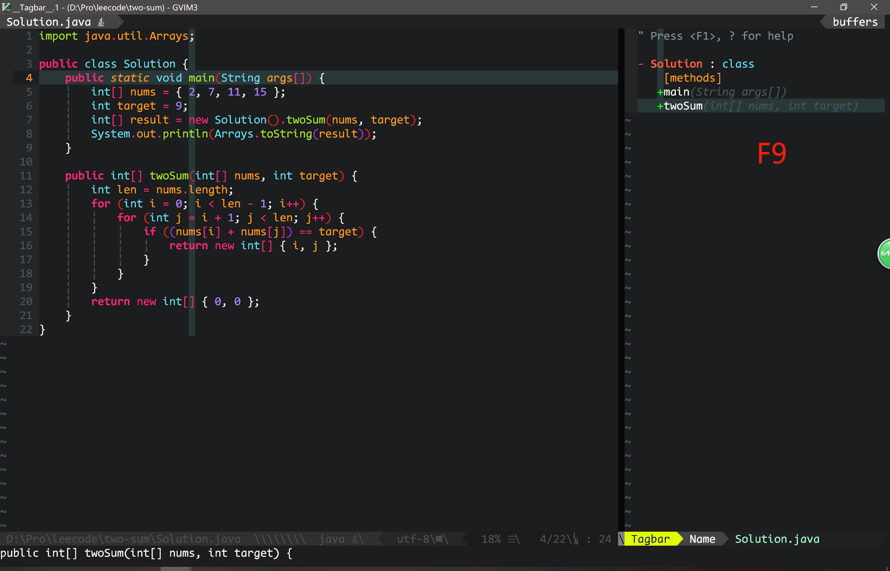
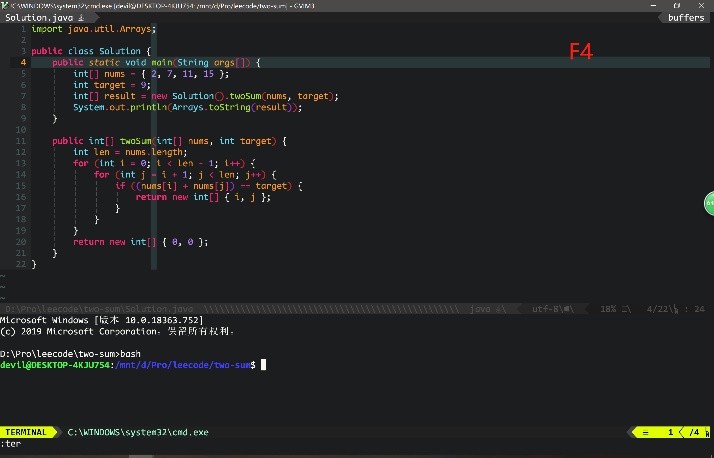
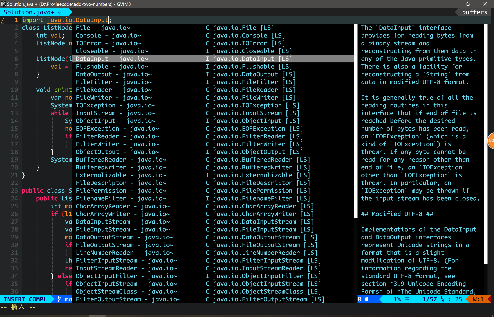
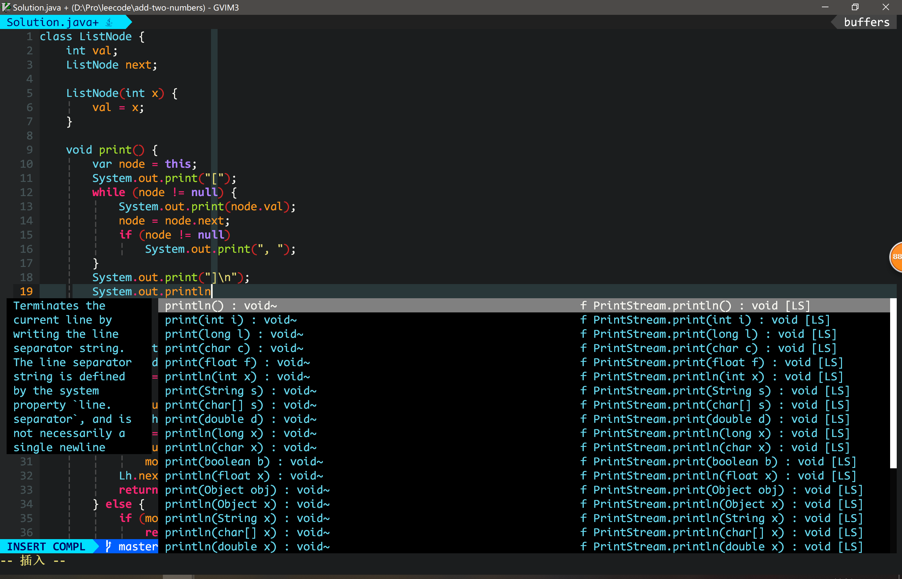

Windows Gvim is continuously updating...

# Vimmer

[Chinese Readme](./README_ZH.md)

**Simple and Fast Vim**

A powerful vim configuration, make your Vim/Gvim like an IDE, it is especially suitable for fullstack developers.

## Stop Updating For Linux

I am so sorry that I have changed my editor from Vim to NeoVim on my Ubuntu.

Vimmer will also be replaced by NVimmer and then stop Updating on Linux.

I recommend NeoVim, please use [NVimmer](https://github.com/devilyouwei/NVimmer) to config your NeoVim.

Still, Vimmer supports Windows Gvim! Because NeoVim is still not stable on Windows.

## Languages Support

1. HTML CSS JS
2. Java
3. C# (removed, use Visual Studio on Windows)
4. vue
5. TypeScript
6. PHP
7. c/c++
8. Markdown
9. json
10. react jsx/tsx
11. kotlin (weak)
12. react jsx/tsx/js
13. emoji
14. English words 10k+

## Quick start

### Install Gvim

Install the [Gvim](https://github.com/vim/vim-win32-installer/releases), they are compiled with Python, Lua, Ruby and so on. You need these supports.

Signed version is recommended!

### Clone the repo

```bash
git clone https://github.com/devilyouwei/Vimmer.git
```

### Basic Configuration

1. Copy config file '.vimrc'(Linux), '\_vimrc'(Windows) and 'vimfiles'(Windows) to your user home directory. Linux is '~/.vimrc', on Windows, it is your username folder in 'C:/Users/Your Username/\_vimrc'
2. Copy '.eslintrc.json' and '.prettierrc.json' to user directory if you need eslint to check your front-end code and use prettier to format your code.
3. Install Nodejs [https://nodejs.org](https://nodejs.org)
4. Install the fonts in '/fonts', Windows move the fonts to 'C:\windows\Fonts\', Linux just double click the font.
5. Install [vim-plug](https://github.com/junegunn/vim-plug). In windows, vimfiles has contained vim-plug so you don't need to install it.
6. Open vim or windows gvim execute `:PlugInstall`

### Install Supporting Tools

If you want to use eslint to check your js code, you need to execute the following cmd to install eslint.
(Mention: In the home directory, '.eslintrc.json' is a global eslint config file. It can be covered by local eslintrc or package.json file in a project.)

```bash
npm install -g eslint
```

**If you are using Linux Ubuntu**

```bash
# tagbar need ctags, autoformat need astyle
sudo apt install ctags
sudo apt install astyle
```

**If you are using Windows**

-   You need to download [Ctags](http://ctags.sourceforge.net/) and [Astyle](https://sourceforge.net/projects/astyle/) manually, then add them to PATH environment.

-   You need to install [Perl](http://strawberryperl.com/)

## Issues

-   If you are using ubuntu, you can install vim-nox to add lua support.

```bash
sudo apt install vim-nox
```

-   For Gvim on Windows, when first time open gvim, lots of errors and can't type any command. Press Ctrl-C to ignore the errors and then input :PlugInstall to install all the plugins. After Plugins done, reopen gvim. Then everything is okay.

-   It doesn't work on java file? Please wait for LSP started.

-   If in gnome-teminal, your NerdTree doesn't show some special chars like file logos, fontawesome. You need to install the MonacoNerd.ttf in fonts folder and change terminal to this font. Or, if you would like to use other styles of nerd fonts, refer to[https://github.com/ryanoasis/nerd-fonts](https://github.com/ryanoasis/nerd-fonts)

-   For Gvim in windows, we recommend 'CodeNewRomanNerd' in fonts folder, because I can't find a monaco font with nerd patched for windows gvim, and I try to patch one manually, but failed for many times.

## How to use

-   Emmet HTML create tags automotically: **Ctrl-O**. Refer to 'Emmet'
-   Open Float Terminal: **F4**
-   Save: **F5**
-   Save and compile run: **F6**
-   Auto format code,document: **F12**
-   Clear blank lines: **F2**
-   Open current directory file tree: **F3**
-   Open tagbar: **F9** (ctags required)
-   Auto completion: COC auto completion, press **Tab** to auto complete
-   Buffer switch: **Ctrl+H**, **Ctrl+L**, **Ctrl+left**, **Ctrl+right**
-   Tab switch: as above, change Ctrl to **shift**
-   Find Definition of functions, classes, enter **'gd'**
-   Find tags, includeing functions, class globally, press: **Ctrl-T** or **ft**
-   Find buffers, press: **Ctrl-B** or **fb**
-   Find files in current path, press: **Ctrl-F** or **Ctrl-P** or **ff**
-   **[new]** Find English words in vim, should in 'Insert Mode' and press: **Ctrl-X** then **Ctrl-W**

## Fonts Recommendation

For **Linux Vim**, we recommend **fonts/linux/MonacoNerd.ttf**

For **Windows Gvim**, we recommend **fonts/win/CodeNewRomanNerd/**

## Examples













